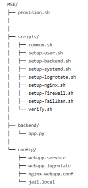
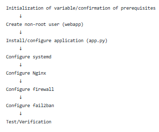
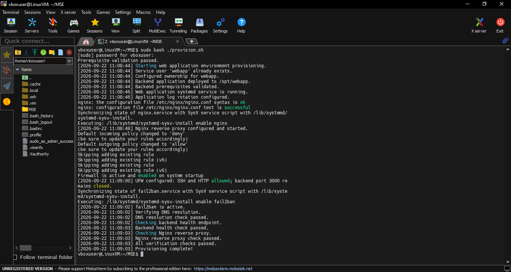
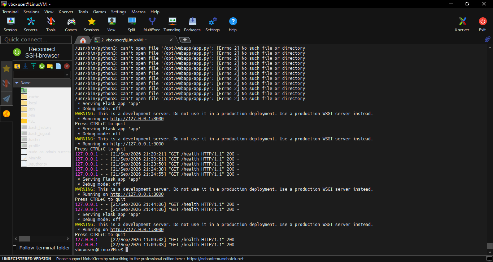
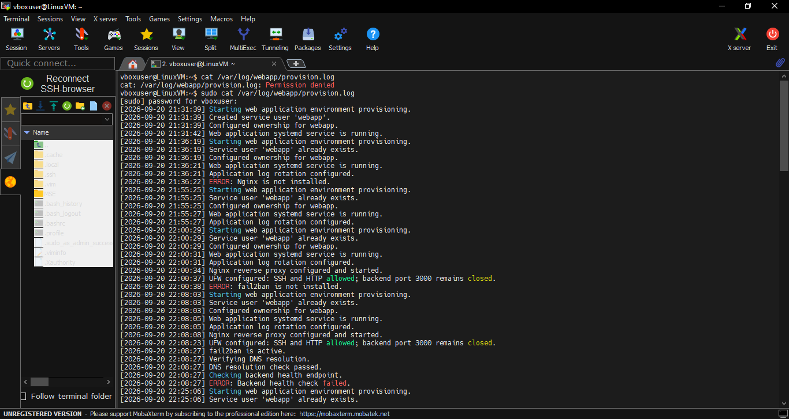
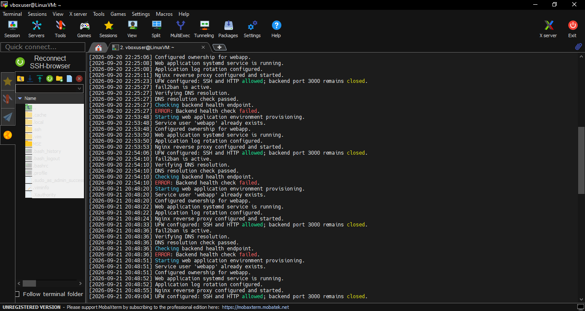
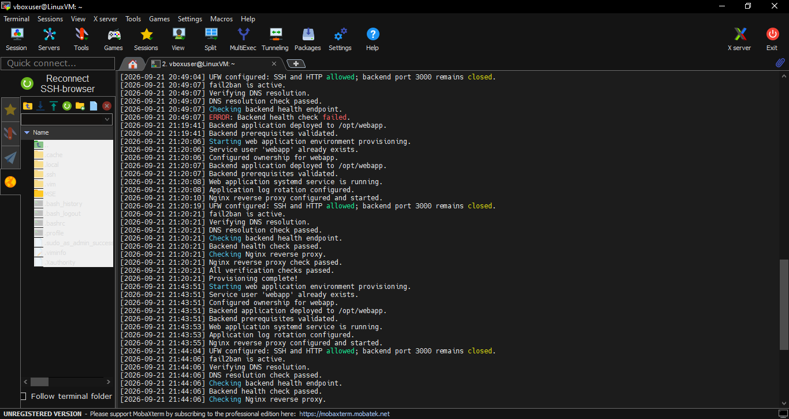
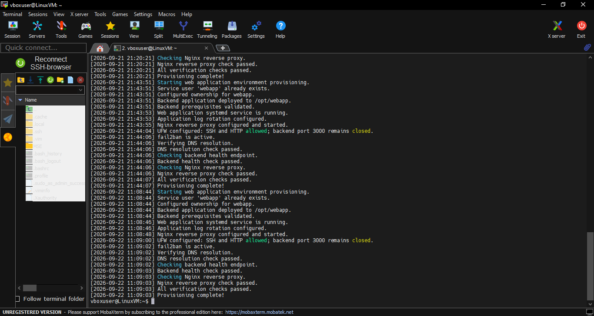

# Multi-service-Linux-Environment

Automating the configuration of a multi-service Linux environment to support the hosting of web applications along side its operational security. The main component in this project is the Nginx web server which will also serve as the reverse proxy, followed by the application backend built with flask and the logging of the web application and provisioning logs. The project will be accomplished with Linux scripts only to demonstrate competence in Linux scripting. 

## The project was configured to meet the following technical Requirements

* Nginx as reverse proxy on port 80, forwarding to a backend on port 3000
* A simple backend application (Python Flask)
* UFW firewall with only necessary ports open
* fail2ban configured for SSH and Nginx
* Dedicated service user (non-root) running the application
* systemd service file for the backend application
* Log rotation configured for application logs
* All scripts use set -euo pipefail
* Idempotent running twice produces the same result without errors
* Logging to a provisioning log file with timestamps
* Input validation and meaningful error messages
* Functions used for modularity (no 500-line monolithic script)

## The project also verifies the following

* DNS resolution
* Verify backend health endpoint
* Verify Nginx connectivity to the backend

## Design Architecture

The project commenced with the installation of relevant component, including Nginx, flask and fail2ban. Then the script for each component were written alongside configuration files. Each of these scripts are then referenced in the main script (provision.sh) allowing a clean and les-complex script for the job. The project tree is shown below.

The script (provision.sh) is the main orchestrator of other scripts, common.sh contains the functions shared by the other scripts such as initialization of variables/project directories and confirmation of project prerequisites. The script (setup-user.sh) sets up a non-root and non-human user (webapp). The script (setup-backend.sh) and file  (webapp.service) are used for the configuration of the backend app (app.py) basically moving it from its folder to the application folder on the Linux server, configuring its logging and assigning the app ownership to early created non-root user (webapp). The script (setup-systemd.sh) is the daemon that mangages the app.py on the Linux server, It takes the backend application and makes it a persistent, automatically managed Linux service while webapp is the identity running it. Additionally, The script (setup-logrotate.sh) and file (webapp-logrotate) manages the app logs to prevent log files from growing infinetely. The script (setup-nginx.sh) and config file (nginx-webapp.conf) configures Nginx to receive web requests and forward them to backend app serving as a reverse proxy. The script (setup-firewall.sh) configures the Ubuntu firewall to control which network connections are allowed into your server, in this case all incoming traffic are denied while only SSH/22 and HTTP/80 are allowed, SSH allows remote accesss to the Linux server while HTTP allows the Nginx server on the Linux server to recieve web requests. The script (setup-fail2ban.sh) was primarily configured to protect the Linux server against repeated failed SSH logins by applying the rules specified in the file (jail.local). Lastly, the script (verify.sh) configures the verification of DNS resolution, the health of the backend and the connectivity of the Nginx web server to it. 

Below is the order of execution of the main processes when the master script (provision.sh) is ran.

## Results

Below shows the succesful running of the scripts with each of the steps been completed from the begining to the end

Below shows the application logs with status 

and then the provision logs from [2026-09-20 21:31:39] to 2026-09-22 11:09:03]

## Conclusion

The project demonstrates the bootsraping of a Linux server and the hosting of web application on it. This project was completed by automating every processes involved which supports Linux server administration at scale while equaly reducing administrative overhead. Likewise, the project integrates security with the app hosting by configuring a reverse proxy to serve as a frontend for the backend app, a firewall to allow only approved traffic, and fail2ban to prevent bruteforce attack against the Linux server. Additionally, log rotation allows the efficient usage of storage space while the logging of provisioning and app logs provide audit trail to support system montoring.

